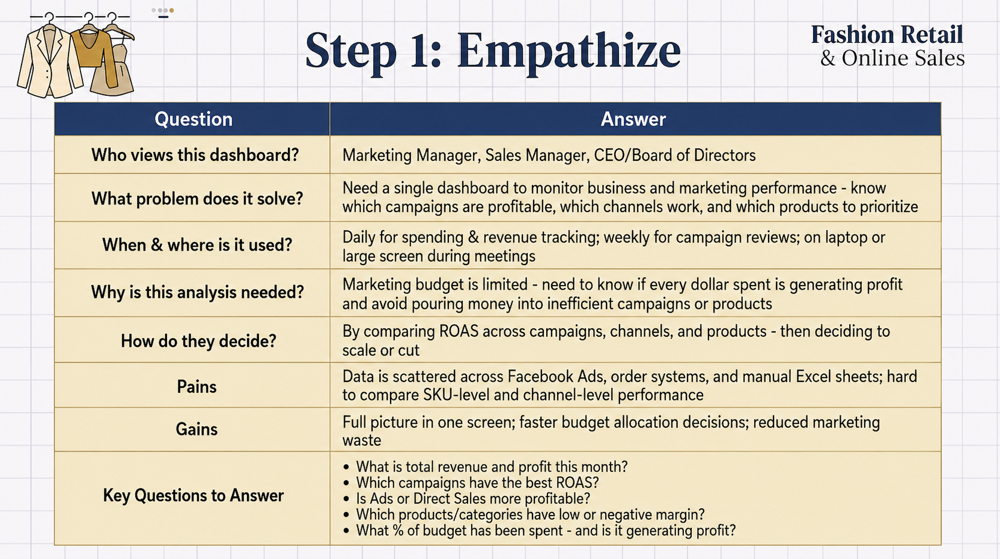
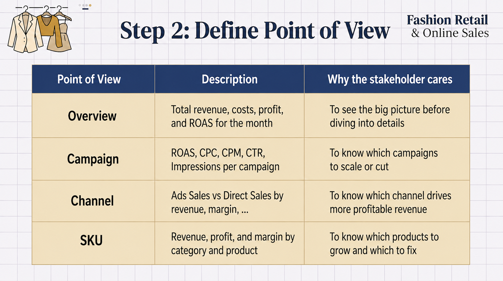
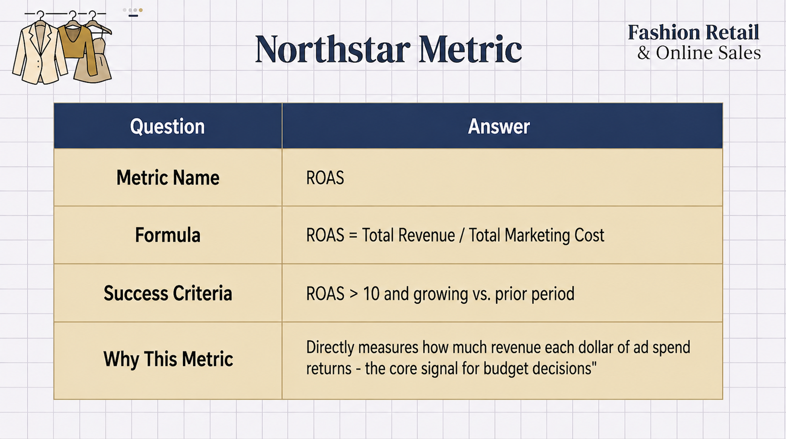

# 📊 Power BI | Fashion Revenue & Marketing Campaign Analysis

  

_A business dashboard to understand how much money is spent on ads, how much revenue comes back, and which products and campaigns are making profit or losing money._

- 🎯 **Business Questions:** How to connect ad spending with actual sales? Which products make money? Which marketing campaigns give the best return?
- 🏬 **Domain:** Fashion Retail & Online Sales
- 🛠️ **Tools:** Power BI

👤 Author: Bạch Minh Nam

---

## 📑 Table of Contents
1. [📌 Background & Overview](#-background--overview)
2. [📂 Dataset Description & Data Structure](#-dataset-description--data-structure)
3. [🧠 Design Thinking Process](#-design-thinking-process)
4. [📊 Key Findings & Visualizations](#-key-findings--visualizations)
5. [🔎 Final Conclusion & Recommendations](#-final-conclusion--recommendations)

---

## 📌 Background & Overview

### Business Problem

The fashion business spends money on ads every day. But how much of that money comes back as profit? Which campaigns work? Which products sell well? This dashboard answers these three key questions:

✔️ **Money & Profit:** How much budget is being used? Is the business making profit or losing money each day/week?

✔️ **Campaign Performance:** Which ad campaigns give the best return? Which channel works better - Facebook ads or direct sales?

✔️ **Product Performance:** Which products make the most money? Which products lose money?

The goal is to connect Facebook ad data with actual sales data, so leadership can make smart decisions about where to spend money next.

### 👤 Who is this project for?

✔️ **Marketing Manager** - Monitor how ads perform. Track cost per click (CPC), impressions, click rate (CTR). Decide which campaigns to scale up or pause.

✔️ **Sales Manager** - Understand which products sell best. See which city buys most. Compare ads sales vs. direct sales.

✔️ **CEO / Board of Directors** - Weekly view of profit and loss. Is the ad budget working? Is the business making money?

---

## 📂 Dataset Description & Data Structure

### 📌 Data Source
- **Source:** Fashion Marketing & Sales Analysis Dataset
- **Format:** Excel Workbook (`.xlsx`)
- **Time Period:** May 2024

### 📊 Data Structure & Relationships

#### 1️⃣ Data Structure

The dataset consists of **4 main tables**:

<b>📦 Table 1: order</b> - Detailed sales transaction data

| Column Name | Description |
|---|---|
| `ID` | Unique order identifier |
| `Thời gian` | Date and time when customer purchased |
| `Mã sản phẩm` | Product/SKU code purchased |
| `Số lượng` | Number of items in the order |
| `Giá` | Selling price (VND) |
| `Giá vốn` | Cost of goods sold / Production cost (VND) |
| `Trạng thái` | Order fulfillment status |

**Total: 3,451 orders in May**

<b>🛍️ Table 2: danh sach san pham</b> - Product catalog

| Column Name | Description |
|---|---|
| `Mã sản phẩm` | Unique product ID |
| `Tên sản phẩm` | Product name like "Lisa Dress 5" or "Audrey Shirt" |
| `Giá bán` | Official retail selling price (VND) |
| `Giá vốn` | Production cost (VND) |
| `Danh mục` | Product category like "Váy" (dress) or "Áo" (shirt) |

**Total: 2,250 different items**

<b>📊 Table 3: mkt_camp_cost</b> - Daily Facebook Ads summary

| Column Name | Description |
|---|---|
| `Tên chiến dịch` | Facebook ad campaign name |
| `Ngày` | Date of the day |
| `Số tiền đã chi tiêu` | Daily spending (VND) |
| `Impressions` | Number of times the ad was shown |
| `Clicks` | Number of clicks on the ad |
| `CTR` | Click-through rate (%) |
| `CPC` | Cost per click (VND) |
| `CPM` | Cost per 1,000 impressions (VND) |

**Total: 854 daily records**

<b>🎯 Table 4: mkt_camp_by_sku_cost</b> - Ad spend broken down by product

| Column Name | Description |
|---|---|
| `Tên chiến dịch` | Name of ad campaign |
| `Ngày` | Date of the day |
| `Mã Sản phẩm` | Product SKU advertised |
| `Số tiền đã chi tiêu (VND)` | Total campaign budget for that day |
| `Tiền đã chạy Theo Sản phẩm` | Ad spend allocated to this specific product |

**Total: 3,874 records**

> For full column details on all tables, see the 📄 [Data Dictionary](data_dictionary.md)
---

#### 2️⃣ Data Relationships

The reporting schema is integrated within Power BI using a Star Schema structure:

- `danh sach san pham` → `order`: 1-to-Many Relationship (mapped via `Mã sản phẩm`)
- `danh sach san pham` → `mkt_camp_by_sku_cost`: 1-to-Many Relationship (mapped via `Mã sản phẩm` / `Mã Sản phẩm`)
- `Dim_Date` → `order`: 1-to-Many Relationship (mapped from `Date` to `Thời gian`)
- `Dim_Date` → `mkt_camp_by_sku_cost`: 1-to-Many Relationship (mapped from `Date` to `Ngày`)
- `dim_mkt_camp_cost` → `fact_mkt_camp_by_sku_cost`: 1-to-Many Relationship (mapped via `CampaignID` to bridge aggregate daily campaign metrics with granular SKU performance)

  

---

## 🧠 Design Thinking Process

### 1️⃣ Empathize - Understanding the Stakeholder

  

### 2️⃣ Define Point of View - Choosing the Right Angles

  

### **⭐ Northstar Metric:** 

  

### 🎯 Strategic Focus & Optimization Priorities

To achieve ROAS > 10 and optimize marketing performance, this report focuses on **4 key pillars aligned with 4 dashboard pages:**

1. **Executive Overview:** Monitor overall revenue, profit, and ROAS to ensure marketing spend generates positive returns
2. **Campaign Efficiency:** Identify high-ROAS campaigns (scale up) vs. low-ROAS campaigns (cut down)
3. **Channel & Customer Performance:** Compare Ads Sales vs. Direct Sales effectiveness and analyze which customer segments drive profitability
4. **Product Profitability:** Identify products with negative margins and prioritize optimization or discontinuation

---

## 📊 Key Findings & Visualizations

### 1️⃣ Page 1 - Executive Overview

  

**💰 Key Findings:**

- ROAS in May 2024 reached 12.11, exceeding the >10 target, alongside Total Revenue of 4,773.55M VND (+5.9%) and 2,858 orders (+6%). At the portfolio level, marketing spend is generating positive returns and the business is on the right track.

- The business deployed 82.7% of its total budget (394M / 476M VND), but profit was highly unstable in the first two weeks with multiple days going negative, dropping as low as -10M VND. This shows that spending more budget does not automatically mean better results.

- From mid-May (May 12) onward, profit gradually stabilized and peaked in the final week (~20M VND/day). This recovery suggests some adjustments were made to campaigns or products, which will be explored further in the following pages.

- Marketing Cost and Marketing-driven Revenue show a clear positive relationship across campaigns. Ads Sales share also grew toward month-end (from ~21% up to 23-40% on certain days), while Direct Sales still dominates at 78-83%, indicating the Ads channel is improving but still has significant room to grow.

---

### 2️⃣ Page 2 - Campaign Performance

  

**📈 Key Findings:**

- ROAS improved progressively throughout the month, peaking at 17.43 in Week 5 despite the lowest weekly spend of 43.4M
- Cost per click (CPC) increased sharply in Weeks 1–2 (reaching approximately 20K VND) before normalizing back to baseline levels
- Cost per mille (CPM) remained relatively stable throughout the month, ranging between 60–80K
- The relationship between Impressions and Click-through Rate (CTR) showed weak correlation, indicating inconsistent audience quality across different campaigns
- AUDREY SHIRT LAL campaigns dominated both spending levels and return performance, with ROAS ranging from 197–625
- Several small-budget campaigns demonstrated ROAS figures of 700–950, though these may reflect attribution overlap with organic and direct sales

---

### 3️⃣ Page 3 - Channel Performance

  

**🎯 Key Findings:**

- Ads Sales generated 63.34% of total revenue (2,952M VND) with a channel ROAS of 7.67
- Direct Sales contributed 36.66% of revenue with ROAS of 4.44, making it less efficient than the Ads channel
- The Membership customer tier dominated revenue across both channels, while Silver, Platinum, Diamond, and Gold VIP tiers contributed marginally
- Hà Nội led all cities with 24.28% of total revenue share and 9.04% profit margin
- Hồ Chí Minh (HCM) generated the second-highest revenue at 12.65% but recorded a lower profit margin of 6.93%
- Secondary cities including Bà Rịa–Vũng Tàu (10.30% revenue) and Đà Nẵng (8.60% revenue) demonstrated stronger profit margins despite lower sales volumes
- Audrey Shirt 3 and Lisa Dress 5 consistently ranked as top-performing products across both sales channels

---

### 4️⃣ Page 4 - SKU Performance

  

**📦 Key Findings:**

- Váy Chiết Eo Xoè leads all product categories in revenue contribution at 31.17% with a solid ROAS of 11.75 and 996M in Ads Revenue
- Áo Tách Set ranks second in revenue but recorded a Total Profit of -259M VND with a negative profit margin of -18.2%, making it the most value-destructive product line
- Váy Chiết Eo Ôm achieved the highest ROAS of 41.89 on minimal spend of 11.6M, representing the most efficient category by return metrics
- Profit margins across all product categories range from -18.2% to +29.4%, indicating significant variation in portfolio performance
- Lisa Dress 5 achieved ROAS of 67.73 and Audrey Shirt 3 achieved ROAS of 9.76, anchoring the top revenue-generating products
- Products in the Áo Tách Set category consistently appear with negative profit figures across all sales channels

---

## 🔎 Final Conclusion & Recommendations

**💡 Recommendations:**

✔️ **Marketing spend demonstrates effectiveness but requires strategic optimization.** The overall ROAS of 12.11 and revenue growth of 5.9% validate that the marketing strategy is directionally sound. However, significant variance between campaigns (ROAS ranging from 7 to 625) and product categories (margins ranging from -18% to +29%) reveals that the portfolio average obscures substantial inefficiency. The priority for the next period is to optimize spending allocation rather than simply increase spending volume.

✔️ **Eliminate marketing investment in Áo Tách Set until restructuring is complete.** Despite being the second-highest revenue category, this product line operates at -259M VND profit with -18.2% margins, meaning each sale reduces overall profitability. No marketing budget should support this category until pricing, discounting strategy, and production costs are fundamentally addressed.

✔️ **Scale AUDREY SHIRT campaigns as the primary growth driver.** These campaigns consistently deliver ROAS of 197–625 at the highest spending levels in the portfolio, representing the clearest, lowest-risk opportunity for budget reallocation and increased investment.

✔️ **Redirect investment toward underutilized high-efficiency products.** Váy Chiết Eo Ôm (ROAS 41.89) and Lisa Dress 5 (ROAS 67.73) are operating on minimal budgets relative to their performance metrics. Reallocating investment from underperforming campaigns would significantly improve overall portfolio ROAS beyond the current 12.11 baseline.

✔️ **Pursue geographic and customer loyalty expansion for sustainable growth.** Secondary cities including Bà Rịa–Vũng Tàu and Đà Nẵng show superior profit margins compared to major cities with lower competitive intensity, making them ideal targets for campaign expansion. Simultaneously, the heavy concentration of revenue in Membership-tier customers indicates a significant opportunity to increase customer lifetime value through loyalty program upgrades without proportionally increasing ad spending.

---
