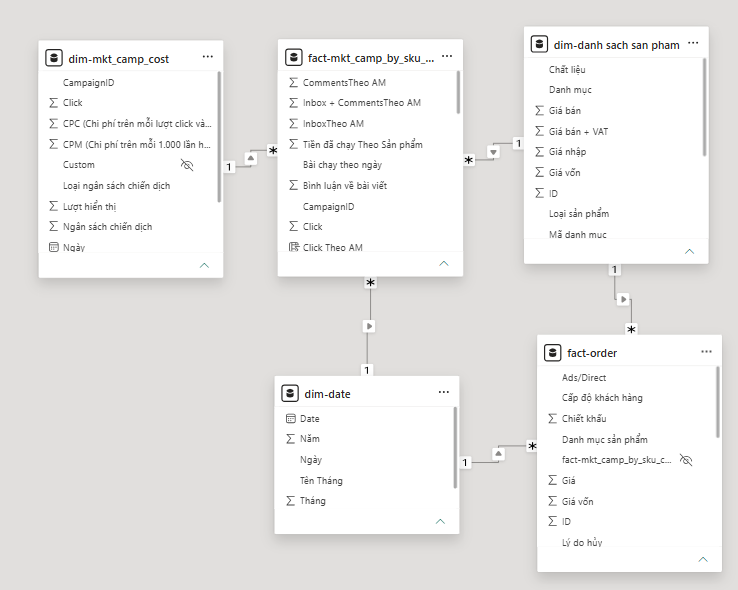
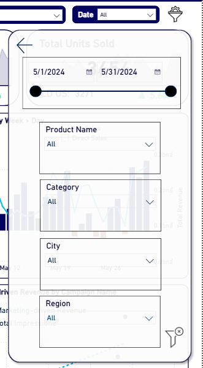
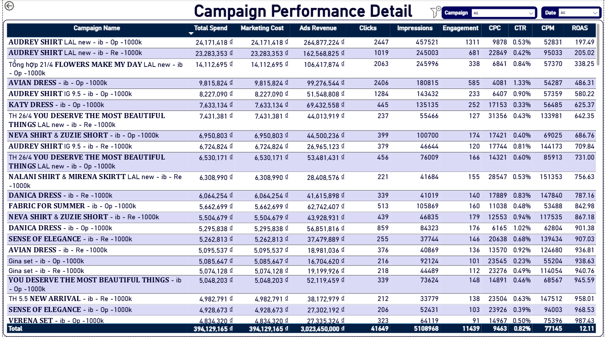
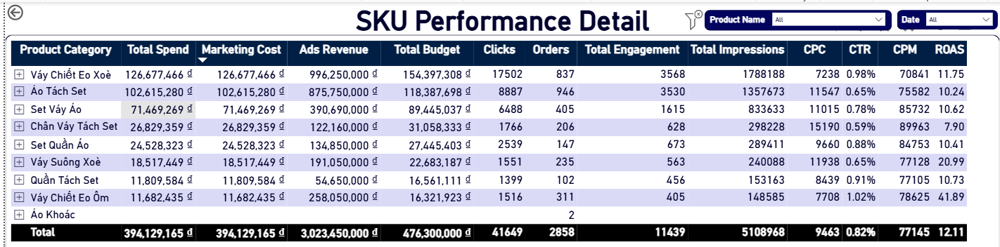
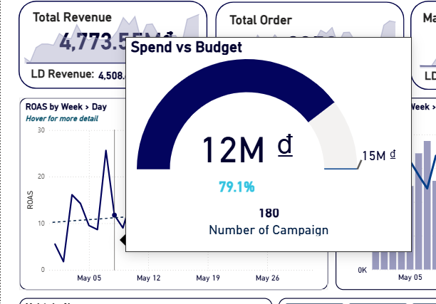
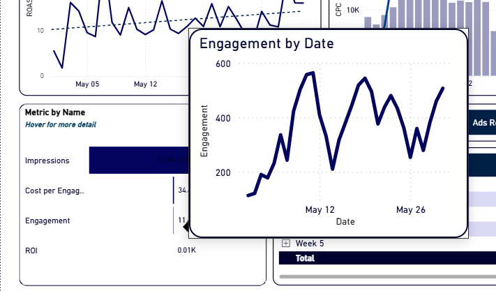
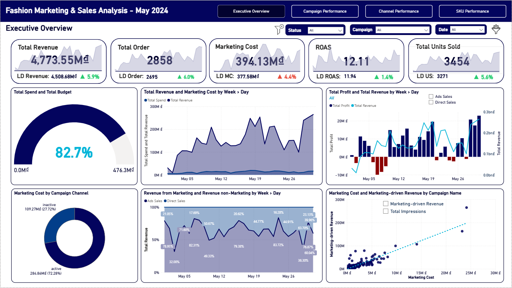
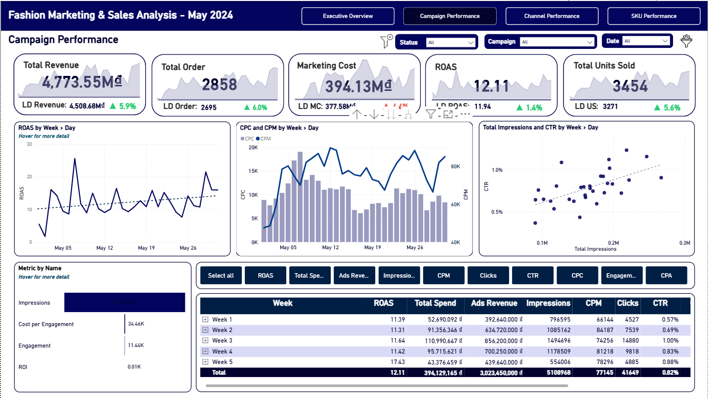
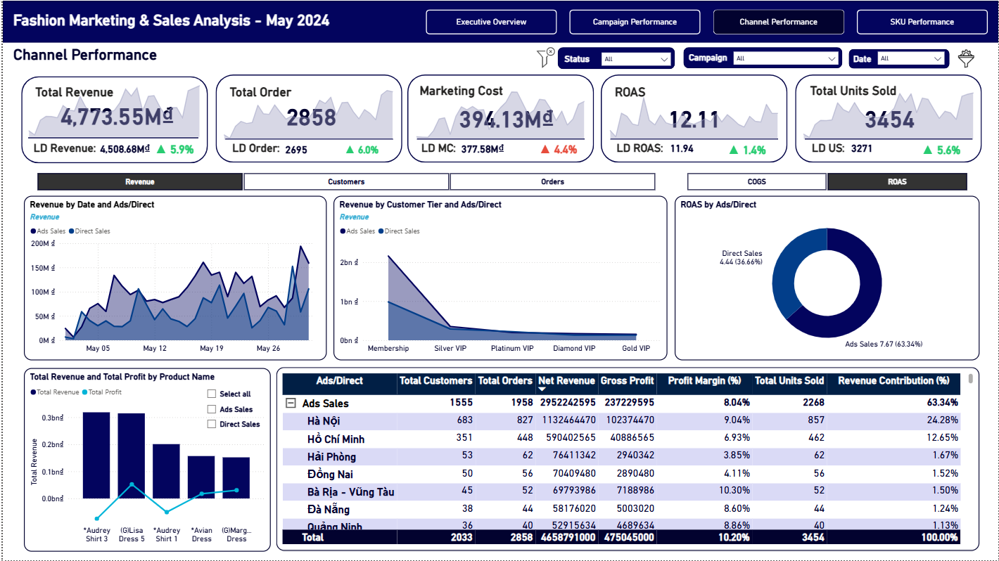
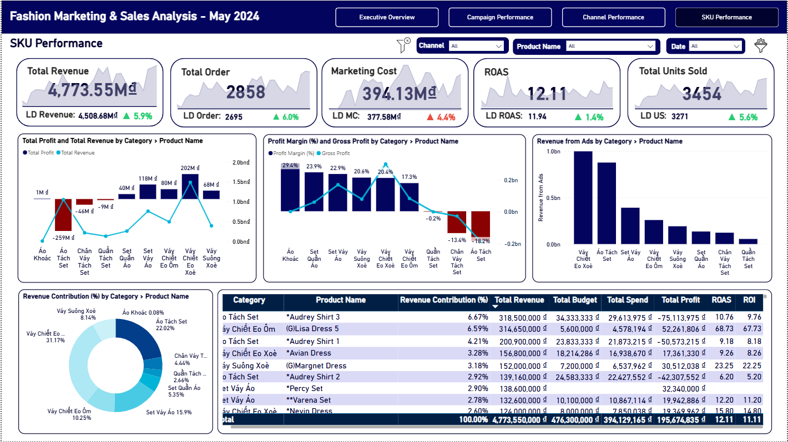

---

  

# 📊 Fashion Revenue & Marketing Campaign Analysis | Power BI

_A business dashboard to understand how much money we spend on ads, how much revenue we make back, and which products and campaigns are making profit or losing money._

- 🎯 **Business Goal:** How do we connect ad spending with actual sales? Which products make money? Which marketing campaigns give us the best return?
- 🏬 **Business Area:** Fashion Retail & Online Sales
- 🛠️ **Tools:** Power BI

👤 Author: Bạch Minh Nam

---

## 📑 Table of Contents
1. [📌 Background & Overview](#-background--overview)
2. [📂 Dataset Description & Data Structure](#-dataset-description--data-structure)
3. [🧠 Design Thinking Process](#-design-thinking-process)
4. [📊 Key Insights & Visualizations](#-key-insights--visualizations)
5. [🔎 Final Conclusion & Recommendations](#-final-conclusion--recommendations)

---

## 📌 Background & Overview

### Objective
The business operates within the fashion retail and e-commerce industry, executing multi-channel marketing campaigns to drive sales growth. The company must understand exactly how each currency unit spent on advertising transforms into profit or loss, eliminating wasted expenditures on underperforming products and ads.

The Executive Board and leadership team require a tactical dashboard to address three fundamental business needs:

✔️ **Executive Overview:** What is our current budget utilization rate? Does the relationship between marketing costs and net revenue reliably deliver optimal net profits on a daily and weekly basis?

✔️ **Campaign & Channel Performance:** Which marketing campaigns yield the highest profitability? How are the ad platform technical metrics (CPC, CPM, CTR) fluctuating? Does the paid acquisition channel (Ads Sales) truly outperform organic/store-driven sales (Direct Sales)?

✔️ **SKU Performance:** Which product categories and SKUs contribute the largest revenue share? Which items achieve excellent ROAS metrics to justify scaling, and which ones are driving margins into negative territory?

The core objective of this project is to build an automated dashboard framework that integrates siloed Facebook Ads data with confirmed backend order fulfillments, empowering leadership to optimize cash flows and make precise budget reallocation choices.

### 👤 Who is this project for?

✔️ **Marketing Manager** - Needs to monitor granular technical ad performance across Meta Ads, control CPM, CPC, CTR, and ROAS trends to optimize creatives, targeting parameters, and adjust weekly spend allocations.

✔️ **Sales Manager** - Needs to manage revenue across distribution channels (Ads vs Direct), examine customer purchasing power by geographical city, and leverage customer loyalty tiers to structure conversion incentives.

✔️ **Board of Directors (CEO/Directors)** - Require a high-level perspective of the financial bottom line, relying on two core metrics (ROAS & Profit Margin %) to control cash flow risks and approve strategic budget expansions.

---

## 📂 Dataset Description & Data Structure

### 📌 Data Source
- **Source:** Fashion Marketing & Sales Analysis Dataset
- **Format:** Excel Workbook (`.xlsx`)
- **Time Period:** May 2024

### 📊 Data Structure & Relationships

#### 1️⃣ Tables Used

The dataset consists of **4 main tables**:

**Table 1: `order`** - Detailed sales transaction data

| Tên Cột | Description |
|---|---|
| ID | Unique order identifier |
| Thời gian | Date and time when customer purchased |
| Mã sản phẩm | Product/SKU code purchased |
| Số lượng | Number of items in the order |
| Giá | Selling price (VND) |
| Giá vốn | Cost of goods sold / Production cost (VND) |
| Trạng thái | Order fulfillment status |

**Total: 3,451 orders in May**

---

**Table 2: `danh sach san pham`** - Product catalog (inventory items)

| Tên Cột | Description |
|---|---|
| Mã sản phẩm | Unique product ID |
| Tên sản phẩm | Product name like "Lisa Dress 5" or "Audrey Shirt" |
| Giá bán | Official retail selling price (VND) |
| Giá vốn | Production cost (VND) |
| Danh mục | Product category like "Váy" (dress) or "Áo" (shirt) |

**Total: 2,250 different items**

---

**Table 3: `mkt_camp_cost`** - Daily Facebook Ads summary

| Tên Cột | Description |
|---|---|
| Tên chiến dịch | Facebook ad campaign name |
| Ngày | Date of the day |
| Số tiền đã chi tiêu | Daily spending (VND) |
| Impressions | Number of times the ad was shown |
| Clicks | Number of clicks on the ad |
| CTR | Click-through rate (%) |
| CPC | Cost per click (VND) |
| CPM | Cost per 1,000 impressions (VND) |

**Total: 854 daily records**

---

**Table 4: `mkt_camp_by_sku_cost`** - Ad spend broken down by product

| Tên Cột | Description |
|---|---|
| Tên chiến dịch | Name of ad campaign |
| Ngày | Date of the day |
| Mã Sản phẩm | Product SKU advertised |
| Số tiền đã chi tiêu (VND) | Total campaign budget for that day |
| Tiền đã chạy Theo Sản phẩm | Ad spend allocated to this specific product |

**Total: 3,874 records**

#### 2️⃣ Table Schema (Core Fields)

**Table: `order`** (Fact Table)

| Tên Cột | Description |
|---|---|
| ID | Unique transaction order identifier |
| Thời gian | Exact datetime stamp of the completed order |
| Mã sản phẩm | Unique product/SKU variant code, used as a key |
| Số lượng | Quantity of items purchased within the order line |
| Giá | Actual transaction selling price for the product line (VND) |
| Giá vốn | Cost of goods sold (COGS) for the product line (VND) |
| Trạng thái | Fulfillment status |

**Table: `danh sach san pham`** (Dimension Table)

| Tên Cột | Description |
|---|---|
| Mã sản phẩm | Primary key representing the unique SKU variant |
| Tên sản phẩm | The full catalog name of the fashion product |
| Giá bán | Official listed retail price of the item (VND) |
| Giá vốn | Master production cost/COGS for the item (VND) |
| Danh mục | General product category grouping |

**Table: `mkt_camp_by_sku_cost`** (Fact Table / Ad Performance)

| Tên Cột | Description |
|---|---|
| Tên chiến dịch | The designated name of the marketing campaign running on Meta Ads |
| Ngày | Reporting calendar date for the ad tracking |
| Mã Sản phẩm | SKU code used to join directly against the master product dimension table |
| Số tiền đã chi tiêu (VND) | Total advertising expenditure for the entire campaign on that day |
| Tiền đã chạy Theo Sản phẩm | Portion of the ad budget allocated specifically to that unique SKU (VND) |

---

#### 3️⃣ Data Relationships

The reporting schema is integrated within Power BI using a Star Schema structure:

- **`danh sach san pham` → `order`**: 1-to-Many Relationship (mapped via the primary tracking key `Mã sản phẩm`)
- **`danh sach san pham` → `mkt_camp_by_sku_cost`**: 1-to-Many Relationship (mapped via the cross-functional keys `Mã sản phẩm` / `Mã Sản phẩm`)
- **`Dim_Date` → `order`**: 1-to-Many Relationship (mapped from `Date` to the order timestamp `Thời gian`)
- **`Dim_Date` → `mkt_camp_by_sku_cost`**: 1-to-Many Relationship (mapped from `Date` to the marketing log date `Ngày`)
- **`dim_mkt_camp_cost` → `fact_mkt_camp_by_sku_cost`**: 1-to-Many Relationship (mapped via the custom-generated tracking key `CampaignID` to bridge aggregate daily campaign metrics with granular SKU performance)

  

---

## 🧠 Design Thinking Process

We followed a simple 3-step thinking process to understand what the business actually needs.

### 1️⃣ Understanding the Users

| Question | Answer |
|---|---|
| **Who uses this?** | Marketing Manager, Sales Manager, CEO/Board |
| **What problem?** | Facebook Ads data is in one place, sales data in another. Hard to see if ads are actually profitable. |
| **When used?** | Marketing team checks daily. Leadership reviews weekly. |
| **Why needed?** | Every dollar spent on ads needs to come back as profit. Can't waste money on bad campaigns. |
| **How will they decide?** | Compare ROAS (return on ad spend) and profit margin. Cut bad campaigns, scale good ones. |
| **Pain Points** | • Takes hours to manually calculate in Excel • Can't see profit/loss clearly • Don't know which products to promote • Hard to justify ad budget to leadership |
| **What Would Help** | • See profit in real-time • Know which products are heroes • Know which campaigns waste money • Data to show CEO |
| **Key Questions** | • Which Facebook campaign gives best return? • What's our overall ROAS? • Which products make money? • Which products lose money? • Do ads work better than direct sales? |

---

### 2️⃣ What Dashboard Angles Do We Need?

| Angle | Purpose | Why It Matters |
|---|---|---|
| **Executive View** | Show total revenue, total ad spend, profit, ROAS, margin %. Big picture. | CEO needs to know: are we making money? |
| **Campaign View** | Show each ad campaign's performance, spending, clicks, ROAS. | Marketing manager needs to know: which campaigns work? which should I pause? |
| **Product View** | Show each product's revenue, profit, ad spend allocation, ROAS. | Sales team needs to know: which items sell? which make profit? |

---

**Two Key Metrics We Track:**

| Metric | What It Means | How To Calculate |
|---|---|---|
| **ROAS (Return On Ad Spend)** | For every 1 VND spent on ads, how many VND come back as revenue? | Ad Revenue ÷ Ad Spend |
| **Profit Margin (%)** | Of every 1 VND in revenue, how much is profit after costs? | (Revenue - Product Cost - Ad Spend) ÷ Revenue × 100 |

---

### 3️⃣ Dashboard Structure

| | **Page 1: Executive Overview** | **Page 2: Campaigns** | **Page 3: Products & Cities** |
|---|---|---|---|
| **Top (Key Numbers)** | Revenue, Orders, Ad Spend, ROAS, Profit Margin | Campaign spend, clicks, CTR, CPC, CPM, Campaign ROAS | Top products, categories, cities |
| **Middle (Trends)** | Daily revenue and profit trend, budget usage | Weekly CPC and CPM trends, performance by week | Revenue by city, profit by city |
| **Bottom (Details)** | Revenue split: Ads vs Direct sales, by customer tier | Campaign details table | Product details table |

---

## ⚒️ Main Process

**Step 1:** Connected Power BI to the Excel file, cleaned up data, fixed date formats.
**Step 2:** Organized data into separate organized tables (Product table, Date table, Order fact table, Ad spending fact table).
**Step 3:** Wrote DAX formulas
**Step 4:** Built 4 dashboard pages with filters, trend charts, and detailed tables.

---

## 📊 Key Insights & Visualizations

### 🔍 Dashboard Features

> **Advanced Features Used**
> - 🔖 **Filters** - Click filter button top right to show/hide filter panel. Can filter by: Date range, Product name, Category, City, Region. Filters apply to all pages.

> 

> - 🔍 **Drill Through** - Right-click or click on any campaign or product to see detailed page with all numbers for that campaign/product.

> 

> 

> - 🔙 **Back Button** - On detail pages, click back arrow to return to main view.

> - 💬 **Hover for Details** - Mouse over any chart to see more information without cluttering the page.

> 
 

>
>
---

#### 1️⃣ Page 1 - Executive Overview

  

📌 **Analysis 1:**

- **Observation:** May 2024 delivered solid top-line results - Total Revenue reached **4,773.55M VND** (+5.9% vs. last period), Total Orders grew 6% to 2,858, and ROAS held at **12.11**. The company deployed **82.7% of its marketing budget** (394M / 476M VND). Despite strong headline numbers, profit was highly volatile - multiple days in Weeks 1–2 recorded **negative Total Profit**, pointing to inefficient early-month spending. Direct Sales consistently drove 78–83% of daily revenue, with Ads Sales spiking toward month-end (up to 40%). The scatter plot confirms a linear positive relationship between Marketing Cost and Marketing-driven Revenue, validating that higher ad spend does return proportionally more revenue - when allocated correctly.

- **Recommendation:**

  - 🔴 **Investigate early-May profit losses.** Negative profit days in Week 1–2 need root-cause analysis - identify which campaigns or SKUs were running below breakeven and whether discounting or high COGS were the driver.
  - 🟡 **Reallocate the remaining 17.3% budget strategically.** Rather than distributing evenly, concentrate residual budget on campaigns already proven to deliver ROAS above 12.
  - 🟢 **Use the spend–revenue correlation to justify scaling.** The scatter plot provides clear evidence that incremental marketing investment yields incremental revenue - a strong data point for budget expansion proposals.

---

#### 2️⃣ Page 2 - Campaign Performance

  

📌 **Analysis 2:**

- **Observation:** ROAS improved progressively across the month, peaking in **Week 5 at 17.43** - the highest weekly ROAS despite the lowest weekly spend (43.4M), suggesting audience warm-up effects compounded over time. CPC spiked sharply in **Week 1–2 (up to ~20K VND)** before normalizing, while CPM stayed relatively stable at 60–80K throughout. The Impressions vs. CTR scatter reveals weak correlation - more impressions did not reliably improve click-through rate, indicating inconsistent audience quality across campaigns. Drill-through to `Campaign_Performance_Detail` shows **AUDREY SHIRT LAL campaigns** dominated both spend (top 3) and returns (ROAS 197–625). Several small-budget campaigns showed ROAS of 700–950, likely inflated by attribution overlap with organic/direct sales.

- **Recommendation:**

  - 🔴 **Audit the Week 1–2 CPC spike.** A near-doubling of cost per click with no CTR improvement signals wasted spend - review bid strategy, audience overlap, and targeting breadth during that window.
  - 🟡 **Validate ultra-high ROAS campaigns before scaling.** ROAS of 700–950 on minimal spend likely reflects misattribution rather than true ad efficiency - cross-check against direct sales orders before increasing budget.
  - 🟢 **Scale AUDREY SHIRT LAL campaigns with confidence.** Proven ROAS of 197–625 at meaningful spend levels - this is the clearest data-backed case for additional budget allocation.

---

#### 3️⃣ Page 3 - Channel Performance

  

📌 **Analysis 3:**

- **Observation:** Ads Sales generated **63.34% of total revenue** (2,952M VND) with a channel ROAS of **7.67**, while Direct Sales contributed 36.66% at ROAS **4.44** - confirming the Ads channel delivers superior efficiency per VND spent. The Membership tier overwhelmingly dominates revenue across both channels, with Silver, Platinum, Diamond, and Gold VIP contributing marginally. Geographically, **Hà Nội led all cities** (24.28% revenue share, 9.04% margin), followed by Hồ Chí Minh (12.65%, margin 6.93%). Secondary cities like **Bà Rịa–Vũng Tàu (10.30%)** and **Đà Nẵng (8.60%)** show stronger profit margins at lower volumes. Top products across both channels were consistently **Audrey Shirt 3 and Lisa Dress 5**.

- **Recommendation:**

  - 🔴 **Address HCM's margin problem (6.93%).** The city generates the 2nd highest revenue but the weakest margin among major cities - audit discount rates, return rates, and shipping costs specific to HCM orders.
  - 🟡 **Activate the loyalty program to move customers up tiers.** The near-total dominance of Membership-tier revenue signals the VIP program is underperforming - structured upgrade incentives could significantly lift AOV and retention.
  - 🟢 **Launch targeted Ads campaigns in Bà Rịa–Vũng Tàu and Đà Nẵng.** High margins at low volume make these cities ideal for cost-efficient expansion - lower competition than Hà Nội/HCM with better profitability per order.

---

#### 4️⃣ Page 4 - SKU Performance

  

📌 **Analysis 4:**

- **Observation:** **Váy Chiết Eo Xoè** leads all categories in revenue contribution (31.17%) with a healthy ROAS of **11.75** and Ads Revenue of 996M - the undisputed hero category. **Áo Tách Set** ranks 2nd in revenue but recorded a **Total Profit of -259M VND** (Profit Margin -18.2%), making it the single most value-destroying product line in the portfolio. At the other extreme, **Váy Chiết Eo Ôm** achieved ROAS of **41.89** on just 11.6M in spend - the most efficient category by far, yet severely underfunded. Profit Margin across categories ranged from **-18.2% to +29.4%**, reflecting an extremely uneven product portfolio. From `SKU_Performance_Detail`, **Lisa Dress 5 (ROAS 67.73)** and **Audrey Shirt 3 (ROAS 9.76)** anchor the top of the revenue table, while Áo Tách Set products consistently appear with negative profit figures.

- **Recommendation:**

  - 🔴 **Halt ad spend on Áo Tách Set immediately.** Spending marketing budget to drive revenue on a -18.2% margin product accelerates losses - freeze campaigns and conduct a full pricing and cost review before resuming.
  - 🟡 **Significantly increase budget for Váy Chiết Eo Ôm.** ROAS of 41.89 with minimal spend is a clear signal of an underfunded high-performer - reallocating even 10–15M from underperforming categories here would materially improve overall ROAS.
  - 🟢 **Protect and grow Váy Chiết Eo Xoè as the flagship category.** Highest revenue, solid ROAS, and proven Ads-driven demand - this is the safest and highest-impact category to scale heading into June.

---

## 🔎 Final Conclusion & Recommendations

📍 Key Takeaways:
✔️ **Marketing spend is working - but only when targeted correctly.** Overall ROAS of 12.11 and revenue growth of +5.9% confirm the marketing strategy is directionally sound. However, the wide variance between campaigns (ROAS 7 to 625) and categories (margin -18% to +29%) shows that the average hides significant inefficiency. The strategic priority for June is not to spend more, but to spend smarter.
✔️ **Áo Tách Set is destroying value at scale.** The 2nd highest-revenue category is running at -259M VND profit and -18.2% margin - meaning every sale made worse the overall P&L. No marketing budget should be directed here until pricing, discounting, and COGS are restructured. This is the single highest-impact fix available.
✔️ **AUDREY SHIRT campaigns are the proven growth engine.** Delivering ROAS of 197–625 at the highest spend levels in the portfolio, these campaigns represent the clearest, lowest-risk opportunity for budget reallocation. Increasing their share of the remaining 17.3% budget is directly supported by the data.
✔️ **Váy Chiết Eo Ôm and Lisa Dress 5 are the biggest missed opportunities.** ROAS of 41.89 and 67.73 respectively, both running on minimal budgets. Shifting investment toward these two - funded by cutting spend on Áo Tách Set and underperforming campaigns - would likely push total ROAS well above the 12.11 baseline.
✔️ **Geographic and loyalty expansion offer structural long-term upside.** Bà Rịa–Vũng Tàu and Đà Nẵng show better margins than HCM at lower competitive intensity - prime targets for June Ads campaigns. Simultaneously, the near-total concentration of revenue in Membership-tier customers signals an untapped loyalty upgrade opportunity that could improve CLV without increasing ad spend.
