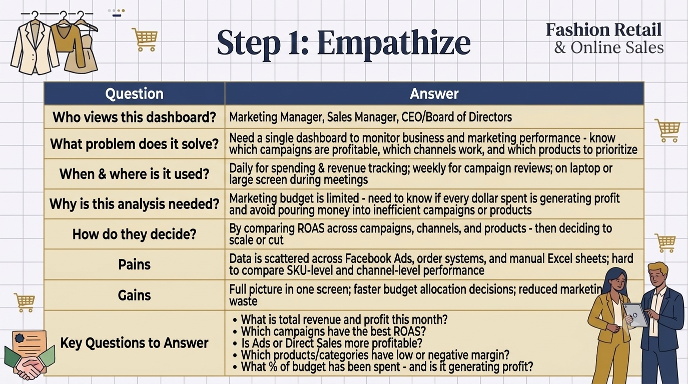
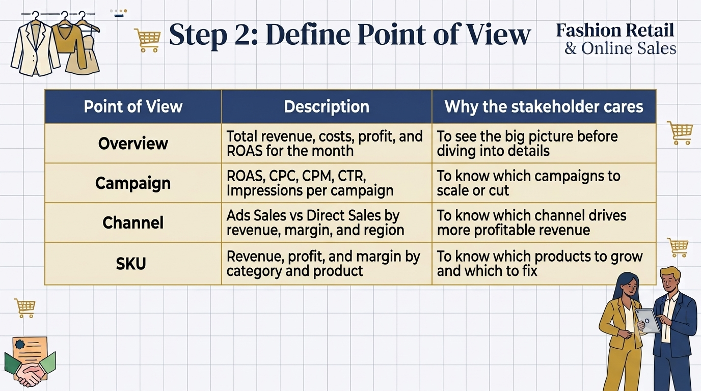
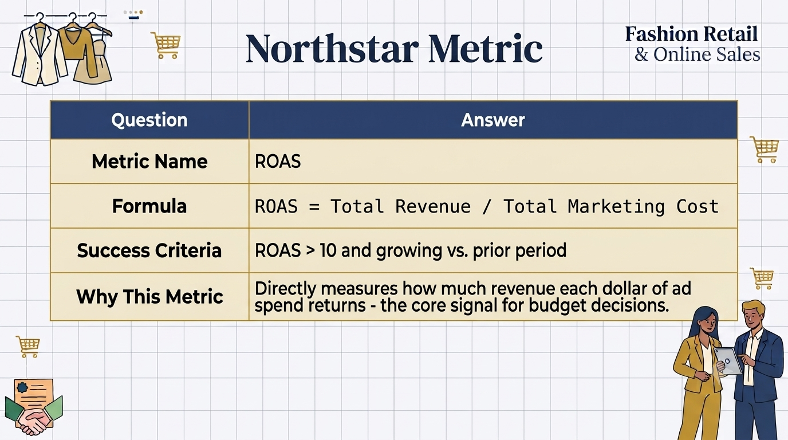
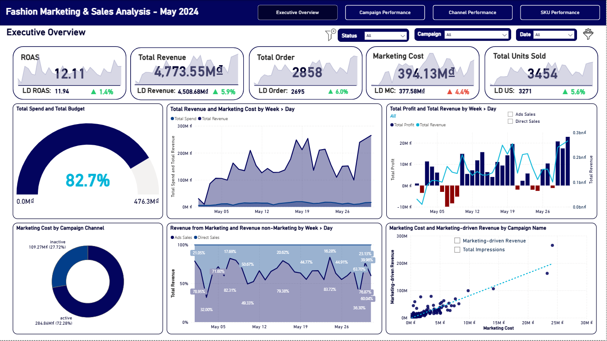
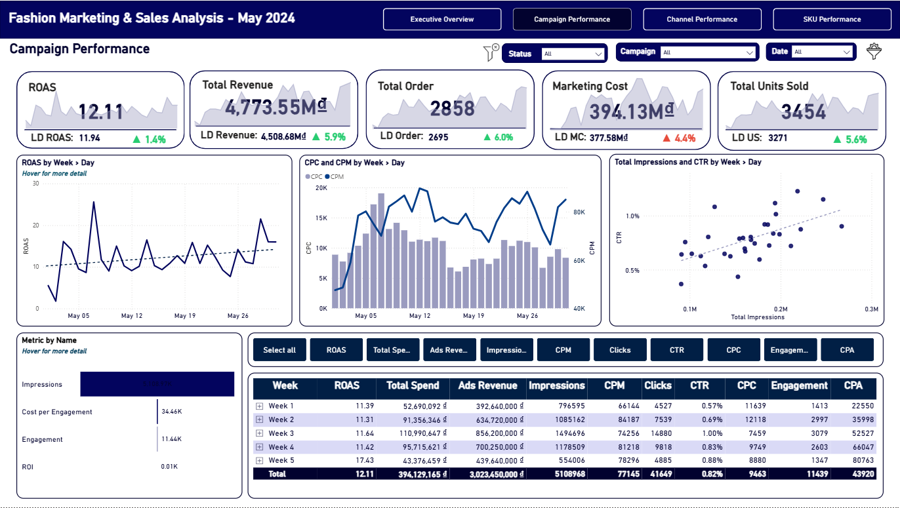
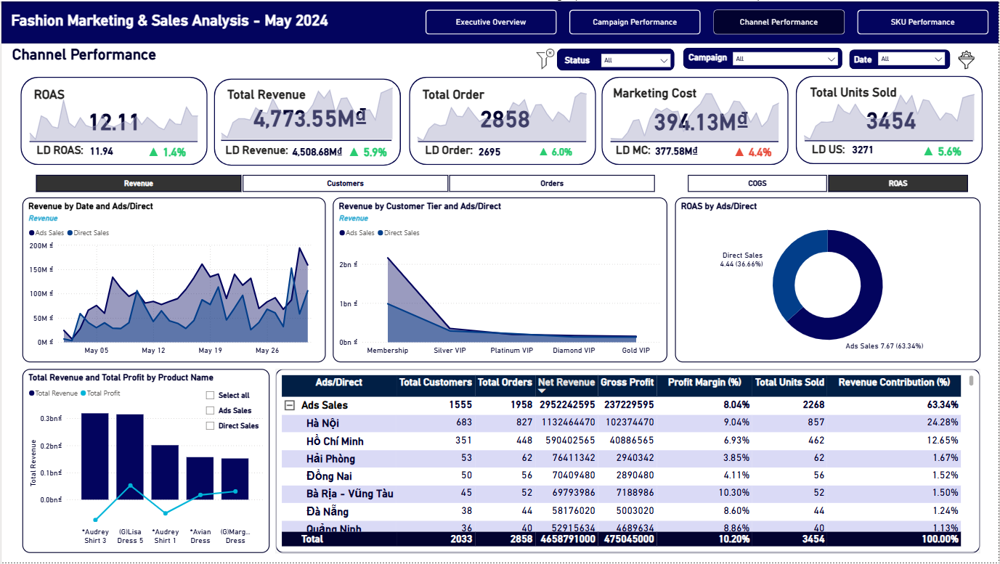
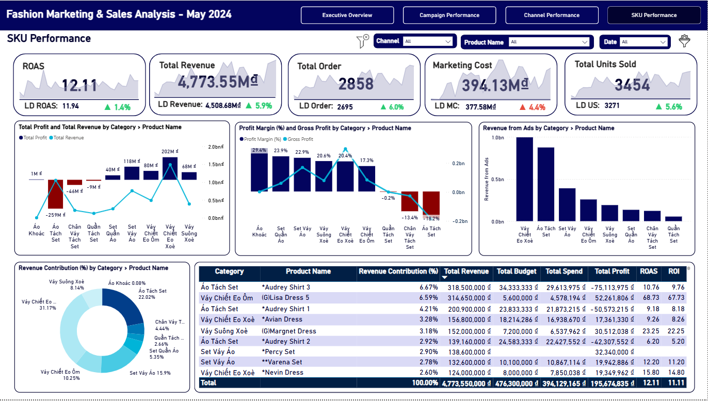

# 📊 Power BI | Fashion Revenue & Marketing Campaign Analysis

  

_A business dashboard to understand how much money is spent on ads, how much revenue comes back, and which products and campaigns are making profit or losing money._

- 🎯 **Business Questions:** How to connect ad spending with actual sales? Which products make money? Which marketing campaigns give the best return?
- 🏬 **Domain:** Fashion Retail & Online Sales
- 🛠️ **Tools:** Power BI

👤 Author: Bạch Minh Nam

---

## 📑 Table of Contents
1. [📌 Background & Overview](#-background--overview)
2. [📂 Dataset Description & Data Structure](#-dataset-description--data-structure)
3. [🧠 Design Thinking Process](#-design-thinking-process)
4. [📊 Key Insights & Visualizations](#-key-insights--visualizations)
5. [🔎 Final Conclusion & Recommendations](#-final-conclusion--recommendations)

---

## 📌 Background & Overview

### Business Problem

The fashion business spends money on ads every day. But how much of that money comes back as profit? Which campaigns work? Which products sell well? This dashboard answers these three key questions:

✔️ **Money & Profit:** How much budget is being used? Is the business making profit or losing money each day/week?

✔️ **Campaign Performance:** Which ad campaigns give the best return? Which channel works better - Facebook ads or direct sales?

✔️ **Product Performance:** Which products make the most money? Which products lose money?

The goal is to connect Facebook ad data with actual sales data, so leadership can make smart decisions about where to spend money next.

### 👤 Who is this project for?

✔️ **Marketing Manager** - Monitor how ads perform. Track cost per click (CPC), impressions, click rate (CTR). Decide which campaigns to scale up or pause.

✔️ **Sales Manager** - Understand which products sell best. See which city buys most. Compare ads sales vs. direct sales.

✔️ **CEO / Board of Directors** - Weekly view of profit and loss. Is the ad budget working? Is the business making money?

---

## 📂 Dataset Description & Data Structure

### 📌 Data Source
- **Source:** Fashion Marketing & Sales Analysis Dataset
- **Format:** Excel Workbook (`.xlsx`)
- **Time Period:** May 2024

### 📊 Data Structure & Relationships

#### 1️⃣ Data Structure

The dataset consists of **4 main tables**:

<b>📦 Table 1: order</b> - Detailed sales transaction data

| Column Name | Description |
|---|---|
| `ID` | Unique order identifier |
| `Thời gian` | Date and time when customer purchased |
| `Mã sản phẩm` | Product/SKU code purchased |
| `Số lượng` | Number of items in the order |
| `Giá` | Selling price (VND) |
| `Giá vốn` | Cost of goods sold / Production cost (VND) |
| `Trạng thái` | Order fulfillment status |

**Total: 3,451 orders in May**

<b>🛍️ Table 2: danh sach san pham</b> - Product catalog

| Column Name | Description |
|---|---|
| `Mã sản phẩm` | Unique product ID |
| `Tên sản phẩm` | Product name like "Lisa Dress 5" or "Audrey Shirt" |
| `Giá bán` | Official retail selling price (VND) |
| `Giá vốn` | Production cost (VND) |
| `Danh mục` | Product category like "Váy" (dress) or "Áo" (shirt) |

**Total: 2,250 different items**

<b>📊 Table 3: mkt_camp_cost</b> - Daily Facebook Ads summary

| Column Name | Description |
|---|---|
| `Tên chiến dịch` | Facebook ad campaign name |
| `Ngày` | Date of the day |
| `Số tiền đã chi tiêu` | Daily spending (VND) |
| `Impressions` | Number of times the ad was shown |
| `Clicks` | Number of clicks on the ad |
| `CTR` | Click-through rate (%) |
| `CPC` | Cost per click (VND) |
| `CPM` | Cost per 1,000 impressions (VND) |

**Total: 854 daily records**

<b>🎯 Table 4: mkt_camp_by_sku_cost</b> - Ad spend broken down by product

| Column Name | Description |
|---|---|
| `Tên chiến dịch` | Name of ad campaign |
| `Ngày` | Date of the day |
| `Mã Sản phẩm` | Product SKU advertised |
| `Số tiền đã chi tiêu (VND)` | Total campaign budget for that day |
| `Tiền đã chạy Theo Sản phẩm` | Ad spend allocated to this specific product |

**Total: 3,874 records**

> For full column details on all tables, see the 📄 [Data Dictionary](data_dictionary.md)
---

#### 2️⃣ Data Relationships

The reporting schema is integrated within Power BI using a Star Schema structure:

- `danh sach san pham` → `order`: 1-to-Many Relationship (mapped via `Mã sản phẩm`)
- `danh sach san pham` → `mkt_camp_by_sku_cost`: 1-to-Many Relationship (mapped via `Mã sản phẩm` / `Mã Sản phẩm`)
- `Dim_Date` → `order`: 1-to-Many Relationship (mapped from `Date` to `Thời gian`)
- `Dim_Date` → `mkt_camp_by_sku_cost`: 1-to-Many Relationship (mapped from `Date` to `Ngày`)
- `dim_mkt_camp_cost` → `fact_mkt_camp_by_sku_cost`: 1-to-Many Relationship (mapped via `CampaignID` to bridge aggregate daily campaign metrics with granular SKU performance)

  

---

## 🧠 Design Thinking Process

### 1️⃣ Empathize - Understanding the Stakeholder

  

### 2️⃣ Define Point of View - Choosing the Right Angles

  

### **⭐ Northstar Metric:** 

  

> 📄 For the full Design Thinking breakdown, see [Fashion Marketing & Sales Analysis Design Thinking](Fashion_Marketing_And_Sales_Analysis_Design_Thinking.pdf)

---

## 📊 Key Insights & Visualizations

### 🔍 Dashboard Features

#### 1️⃣ Page 1 - Executive Overview

  

📌 **Analysis 1:**

- **Observation:** May 2024 delivered solid top-line results - Total Revenue reached **4,773.55M VND** (+5.9% vs. last period), Total Orders grew 6% to 2,858, and ROAS held at **12.11**. The company deployed **82.7% of its marketing budget** (394M / 476M VND). Despite strong headline numbers, profit was highly volatile - multiple days in Weeks 1–2 recorded **negative Total Profit**, pointing to inefficient early-month spending. Direct Sales consistently drove 78–83% of daily revenue, with Ads Sales spiking toward month-end (up to 40%). The scatter plot confirms a linear positive relationship between Marketing Cost and Marketing-driven Revenue, validating that higher ad spend does return proportionally more revenue - when allocated correctly.

- **Recommendation:**
  - 🔴 **Investigate early-May profit losses.** Negative profit days in Week 1–2 need root-cause analysis - identify which campaigns or SKUs were running below breakeven and whether discounting or high COGS were the driver.
  - 🟡 **Reallocate the remaining 17.3% budget strategically.** Rather than distributing evenly, concentrate residual budget on campaigns already proven to deliver ROAS above 12.
  - 🟢 **Use the spend–revenue correlation to justify scaling.** The scatter plot provides clear evidence that incremental marketing investment yields incremental revenue - a strong data point for budget expansion proposals.

---

#### 2️⃣ Page 2 - Campaign Performance

  

📌 **Analysis 2:**

- **Observation:** ROAS improved progressively across the month, peaking in **Week 5 at 17.43** - the highest weekly ROAS despite the lowest weekly spend (43.4M), suggesting audience warm-up effects compounded over time. CPC spiked sharply in **Week 1–2 (up to ~20K VND)** before normalizing, while CPM stayed relatively stable at 60–80K throughout. The Impressions vs. CTR scatter reveals weak correlation - more impressions did not reliably improve click-through rate, indicating inconsistent audience quality across campaigns. Drill-through to `Campaign_Performance_Detail` shows **AUDREY SHIRT LAL campaigns** dominated both spend (top 3) and returns (ROAS 197–625). Several small-budget campaigns showed ROAS of 700–950, likely inflated by attribution overlap with organic/direct sales.

- **Recommendation:**
  - 🔴 **Audit the Week 1–2 CPC spike.** A near-doubling of cost per click with no CTR improvement signals wasted spend - review bid strategy, audience overlap, and targeting breadth during that window.
  - 🟡 **Validate ultra-high ROAS campaigns before scaling.** ROAS of 700–950 on minimal spend likely reflects misattribution rather than true ad efficiency - cross-check against direct sales orders before increasing budget.
  - 🟢 **Scale AUDREY SHIRT LAL campaigns with confidence.** Proven ROAS of 197–625 at meaningful spend levels - this is the clearest data-backed case for additional budget allocation.

---

#### 3️⃣ Page 3 - Channel Performance

  

📌 **Analysis 3:**

- **Observation:** Ads Sales generated **63.34% of total revenue** (2,952M VND) with a channel ROAS of **7.67**, while Direct Sales contributed 36.66% at ROAS **4.44** - confirming the Ads channel delivers superior efficiency per VND spent. The Membership tier overwhelmingly dominates revenue across both channels, with Silver, Platinum, Diamond, and Gold VIP contributing marginally. Geographically, **Hà Nội led all cities** (24.28% revenue share, 9.04% margin), followed by Hồ Chí Minh (12.65%, margin 6.93%). Secondary cities like **Bà Rịa–Vũng Tàu (10.30%)** and **Đà Nẵng (8.60%)** show stronger profit margins at lower volumes. Top products across both channels were consistently **Audrey Shirt 3 and Lisa Dress 5**.

- **Recommendation:**
  - 🔴 **Address HCM's margin problem (6.93%).** The city generates the 2nd highest revenue but the weakest margin among major cities - audit discount rates, return rates, and shipping costs specific to HCM orders.
  - 🟡 **Activate the loyalty program to move customers up tiers.** The near-total dominance of Membership-tier revenue signals the VIP program is underperforming - structured upgrade incentives could significantly lift AOV and retention.
  - 🟢 **Launch targeted Ads campaigns in Bà Rịa–Vũng Tàu and Đà Nẵng.** High margins at low volume make these cities ideal for cost-efficient expansion - lower competition than Hà Nội/HCM with better profitability per order.

---

#### 4️⃣ Page 4 - SKU Performance

  

📌 **Analysis 4:**

- **Observation:** **Váy Chiết Eo Xoè** leads all categories in revenue contribution (31.17%) with a healthy ROAS of **11.75** and Ads Revenue of 996M - the undisputed hero category. **Áo Tách Set** ranks 2nd in revenue but recorded a **Total Profit of -259M VND** (Profit Margin -18.2%), making it the single most value-destroying product line in the portfolio. At the other extreme, **Váy Chiết Eo Ôm** achieved ROAS of **41.89** on just 11.6M in spend - the most efficient category by far, yet severely underfunded. Profit Margin across categories ranged from **-18.2% to +29.4%**, reflecting an extremely uneven product portfolio. From `SKU_Performance_Detail`, **Lisa Dress 5 (ROAS 67.73)** and **Audrey Shirt 3 (ROAS 9.76)** anchor the top of the revenue table, while Áo Tách Set products consistently appear with negative profit figures.

- **Recommendation:**
  - 🔴 **Halt ad spend on Áo Tách Set immediately.** Spending marketing budget to drive revenue on a -18.2% margin product accelerates losses - freeze campaigns and conduct a full pricing and cost review before resuming.
  - 🟡 **Significantly increase budget for Váy Chiết Eo Ôm.** ROAS of 41.89 with minimal spend is a clear signal of an underfunded high-performer - reallocating even 10–15M from underperforming categories here would materially improve overall ROAS.
  - 🟢 **Protect and grow Váy Chiết Eo Xoè as the flagship category.** Highest revenue, solid ROAS, and proven Ads-driven demand - this is the safest and highest-impact category to scale heading into June.

---

## 🔎 Final Conclusion & Recommendations

📍 Key Takeaways:

✔️ **Marketing spend is working - but only when targeted correctly.** Overall ROAS of 12.11 and revenue growth of +5.9% confirm the marketing strategy is directionally sound. However, the wide variance between campaigns (ROAS 7 to 625) and categories (margin -18% to +29%) shows that the average hides significant inefficiency. The strategic priority for June is not to spend more, but to spend smarter.

✔️ **Áo Tách Set is destroying value at scale.** The 2nd highest-revenue category is running at -259M VND profit and -18.2% margin - meaning every sale made the overall P&L worse. No marketing budget should be directed here until pricing, discounting, and COGS are restructured. This is the single highest-impact fix available.

✔️ **AUDREY SHIRT campaigns are the proven growth engine.** Delivering ROAS of 197–625 at the highest spend levels in the portfolio, these campaigns represent the clearest, lowest-risk opportunity for budget reallocation. Increasing their share of the remaining 17.3% budget is directly supported by the data.

✔️ **Váy Chiết Eo Ôm and Lisa Dress 5 are the biggest missed opportunities.** ROAS of 41.89 and 67.73 respectively, both running on minimal budgets. Shifting investment toward these two - funded by cutting spend on Áo Tách Set and underperforming campaigns - would likely push total ROAS well above the 12.11 baseline.

✔️ **Geographic and loyalty expansion offer structural long-term upside.** Bà Rịa–Vũng Tàu and Đà Nẵng show better margins than HCM at lower competitive intensity - prime targets for June Ads campaigns. Simultaneously, the near-total concentration of revenue in Membership-tier customers signals an untapped loyalty upgrade opportunity that could improve CLV without increasing ad spend.
