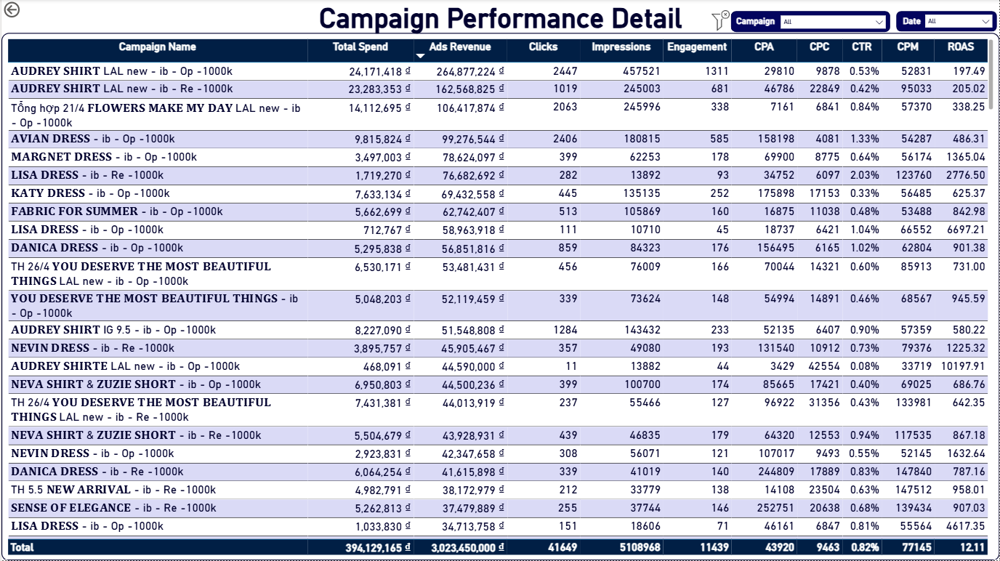
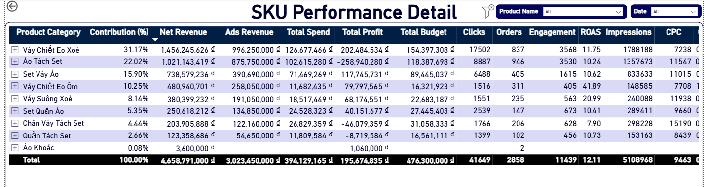

# 📊 Power BI | Fashion Revenue & Marketing Campaign Analysis

  

_A business dashboard to understand how much money is spent on ads, how much revenue comes back, and which products and campaigns are making profit or losing money._

- 🎯 **Business Questions:** How to connect ad spending with actual sales? Which products make money? Which marketing campaigns give the best return?
- 🏬 **Domain:** Fashion Retail & Online Sales
- 🛠️ **Tools:** Power BI

👤 Author: Bạch Minh Nam

---

## 📑 Table of Contents
1. [📌 Background & Overview](#-background--overview)
2. [📂 Dataset Description & Data Structure](#-dataset-description--data-structure)
3. [🧠 Design Thinking Process](#-design-thinking-process)
4. [📊 Key Findings & Visualizations](#-key-findings--visualizations)
5. [🔎 Final Conclusion & Recommendations](#-final-conclusion--recommendations)

---

## 📌 Background & Overview

### Business Problem

The fashion business spends money on ads every day. But how much of that money comes back as profit? Which campaigns work? Which products sell well? This dashboard answers these three key questions:

✔️ **Money & Profit:** How much budget is being used? Is the business making profit or losing money each day/week?

✔️ **Campaign Performance:** Which ad campaigns give the best return? Which channel works better - Facebook ads or direct sales?

✔️ **Product Performance:** Which products make the most money? Which products lose money?

The goal is to connect Facebook ad data with actual sales data, so leadership can make smart decisions about where to spend money next.

### 👤 Who is this project for?

✔️ **Marketing Manager** - Monitor how ads perform. Track cost per click (CPC), impressions, click rate (CTR). Decide which campaigns to scale up or pause.

✔️ **Sales Manager** - Understand which products sell best. See which city buys most. Compare ads sales vs. direct sales.

✔️ **CEO / Board of Directors** - Weekly view of profit and loss. Is the ad budget working? Is the business making money?

---

## 📂 Dataset Description & Data Structure

### 📌 Data Source
- **Source:** Fashion Marketing & Sales Analysis Dataset
- **Format:** Excel Workbook (`.xlsx`)
- **Time Period:** May 2024

### 📊 Data Structure & Relationships

#### 1️⃣ Data Structure

The dataset consists of **4 main tables**:

<b>📦 Table 1: order</b> - Detailed sales transaction data

| Column Name | Description |
|---|---|
| `ID` | Unique order identifier |
| `Thời gian` | Date and time when customer purchased |
| `Mã sản phẩm` | Product/SKU code purchased |
| `Số lượng` | Number of items in the order |
| `Giá` | Selling price (VND) |
| `Giá vốn` | Cost of goods sold / Production cost (VND) |
| `Trạng thái` | Order fulfillment status |

**Total: 3,451 orders in May**

<b>🛍️ Table 2: danh sach san pham</b> - Product catalog

| Column Name | Description |
|---|---|
| `Mã sản phẩm` | Unique product ID |
| `Tên sản phẩm` | Product name like "Lisa Dress 5" or "Audrey Shirt" |
| `Giá bán` | Official retail selling price (VND) |
| `Giá vốn` | Production cost (VND) |
| `Danh mục` | Product category like "Váy" (dress) or "Áo" (shirt) |

**Total: 2,250 different items**

<b>📊 Table 3: mkt_camp_cost</b> - Daily Facebook Ads summary

| Column Name | Description |
|---|---|
| `Tên chiến dịch` | Facebook ad campaign name |
| `Ngày` | Date of the day |
| `Số tiền đã chi tiêu` | Daily spending (VND) |
| `Impressions` | Number of times the ad was shown |
| `Clicks` | Number of clicks on the ad |
| `CTR` | Click-through rate (%) |
| `CPC` | Cost per click (VND) |
| `CPM` | Cost per 1,000 impressions (VND) |

**Total: 854 daily records**

<b>🎯 Table 4: mkt_camp_by_sku_cost</b> - Ad spend broken down by product

| Column Name | Description |
|---|---|
| `Tên chiến dịch` | Name of ad campaign |
| `Ngày` | Date of the day |
| `Mã Sản phẩm` | Product SKU advertised |
| `Số tiền đã chi tiêu (VND)` | Total campaign budget for that day |
| `Tiền đã chạy Theo Sản phẩm` | Ad spend allocated to this specific product |

**Total: 3,874 records**

> For full column details on all tables, see the 📄 [Data Dictionary](data_dictionary.md)
---

#### 2️⃣ Data Relationships

The reporting schema is integrated within Power BI using a Star Schema structure:

- `danh sach san pham` → `order`: 1-to-Many Relationship (mapped via `Mã sản phẩm`)
- `danh sach san pham` → `mkt_camp_by_sku_cost`: 1-to-Many Relationship (mapped via `Mã sản phẩm` / `Mã Sản phẩm`)
- `Dim_Date` → `order`: 1-to-Many Relationship (mapped from `Date` to `Thời gian`)
- `Dim_Date` → `mkt_camp_by_sku_cost`: 1-to-Many Relationship (mapped from `Date` to `Ngày`)
- `dim_mkt_camp_cost` → `fact_mkt_camp_by_sku_cost`: 1-to-Many Relationship (mapped via `CampaignID` to bridge aggregate daily campaign metrics with granular SKU performance)

  

---

## 🧠 Design Thinking Process

### 1️⃣ Empathize - Understanding the Stakeholder

  

### 2️⃣ Define Point of View - Choosing the Right Angles

  

### **⭐ Northstar Metric:** 

  

---

## 📊 Key Findings & Visualizations

### 1️⃣ Page 1 - Executive Overview

  

**💰 Key Findings:**

- ROAS in May 2024 reached **12.1**, exceeding the **>10 target**, alongside Total Revenue of **4,773.55M VND** and **2,858 orders**. At the portfolio level, marketing spend is generating positive returns and the business is on the right track.

- The business deployed **82.7% of its total budget** (394M / 476M VND), but profit was highly unstable in the first two weeks with multiple days going negative, dropping as low as **-10M VND**. This shows that spending more budget does not automatically mean better results.

- From **mid-May (May 12)** onward, profit gradually stabilized and peaked in the final week **(~20M VND/day)**. This recovery suggests some adjustments were made to campaigns or products, which will be explored further in the following pages.

- Marketing Cost and Marketing-driven Revenue show a **clear positive relationship** across campaigns. Ads Sales share also grew toward month-end (from **~21% up to 23-40%** on certain days), while Direct Sales still dominates at **78-83%**, indicating the Ads channel is improving but still has significant room to grow.

---

### 2️⃣ Page 2 - Campaign Performance

  

**📈 Key Findings:**

- On days with **244 campaigns** running at the same time, ROAS fell to around **3-4** [(May 02)](Images/may_02.png). When campaigns were cut down to **128**, ROAS recovered to **~25** [(May 07)](Images/may_07.png). Too many campaigns running at once is spreading the budget too thin and pulling overall performance down.

- CPC spiked to **~20K VND** per click in early May, right when ROAS was at its lowest. CTR also did not go up when Impressions went up, meaning more people seeing the ads did not lead to more clicks. **Ad targeting quality was inconsistent** across campaigns.

- ROAS grew steadily from **11.4 in Week 1** to **17.4 in Week 5**, while spend actually dropped from **52M to 43M VND**. Less spend but better focus led to better returns week over week.

  

- **AUDREY SHIRT LAL new** campaigns brought in **~427M VND** in Ads Revenue from only **47M VND** spent, making them the top performers in the portfolio. Several smaller campaigns with just **5-7M VND** in spend also showed strong Ads Revenue but have not been scaled up yet, which is a missed opportunity.

---

### 3️⃣ Page 3 - Channel Performance

  

**🎯 Key Findings:**

- **Ads Sales** brought in **63.3%** of total revenue with ROAS of **7.7**, but **Direct Sales** had a much better profit margin (**13.9% vs 8%**). Ads drives more revenue, but Direct Sales keeps more profit per sale.

- **Membership tier** customers made up the large majority of revenue and orders across both channels. Silver VIP, Platinum VIP, Gold VIP, and Diamond VIP tiers contributed very little, showing a big opportunity to move more customers up the loyalty tiers.

- **Audrey Shirt 3** and **Lisa Dress 5** were the top revenue products across both channels. How profitable they actually are will be looked at more closely in the next page.

- `Hà Nội` led all cities at **24.3%** of revenue but only a **9.04%** margin. `HCM` was second at **12.65%** with an even lower **6.9%** margin. Smaller cities like `Ninh Bình` **(17.4%)**, `Lâm Đồng` **(15.3%)**, and `Khánh Hòa` **(11.4%)** actually had much better margins despite lower sales. `Long An` **(-1%)** and `Phú Thọ` **(-4.4%)** are currently losing money.

---

### 4️⃣ Page 4 - SKU Performance

  

**📦 Key Findings:**

- `Váy Chiết Eo Xoè` led all categories with **31.17%** of total revenue, a **20.4% profit margin**, and nearly **1B VND** in Ads Revenue. It is clearly the strongest category in the portfolio.

- As mentioned in the Channel Performance page, **Audrey Shirt 3** and **Lisa Dress 5** were the top revenue products. But the numbers here tell a different story. Audrey Shirt 3 is actually losing **-75M VND** in profit with a ROAS of only **9.8**. Lisa Dress 5 is the real winner, with **+52M VND** profit and ROAS of **67.7**.

  

- `Áo Tách Set` is the biggest problem in the portfolio. It brings in **22%** of revenue but is losing **-258M VND** in profit. Two more categories are also in the red: `Chân Váy Tách Set` **(-46M VND)** and `Quần Tách Set` **(-8.7M VND)**. Together, these three categories are losing over **-313M VND** in total, all while showing decent revenue on the surface.

- `Váy Chiết Eo Ôm` is being overlooked. Only **11M VND** in spend but ROAS reached **41.9** with solid profit. This category deserves a much bigger budget than it is currently getting.

---

## 🔎 Final Conclusion & Recommendations

**💡 Recommendations:**

✔️ The overall numbers look healthy with **ROAS at 12.11** and revenue growing **+5.9%**, but the data shows the average is hiding real problems underneath. The priority is not to spend more, but to **spend smarter**.

✔️ **Stop putting budget into loss-making categories immediately.** `Áo Tách Set`, `Chân Váy Tách Set`, and `Quần Tách Set` are together losing **over -313M VND** in profit while still taking up a large share of budget. Every sale in these categories is actively reducing profit. No marketing budget should go their way until pricing and costs are fixed.

✔️ **Reduce the number of campaigns running at the same time.** Data from Page 2 shows that running **244 campaigns** at once dropped ROAS to 3-4, while cutting down to **128 campaigns** brought ROAS back to ~25. Focus budget on proven performers like **AUDREY SHIRT LAL new** and high-efficiency small campaigns that have not been scaled yet.

✔️ **Shift more budget toward high-return categories.** `Váy Chiết Eo Ôm` is delivering **ROAS of 41.89** on just 11M VND in spend, and **Lisa Dress 5** is generating +52M VND profit with ROAS of 67.73. These are the real growth opportunities and are currently being underfunded.

✔️ **Expand into smaller cities with stronger margins.** `Hà Nội` and `HCM` dominate revenue but have weaker margins. Cities like `Ninh Bình` **(17.36%)**, `Lâm Đồng` **(15.35%)**, and `Khánh Hòa` **(11.38%)** show that smaller markets can be significantly more profitable and are worth targeting more aggressively.

✔️ **Invest in moving customers up the loyalty tiers.** Right now **Membership tier** is carrying almost all revenue while Silver VIP, Platinum VIP, and above contribute very little. Growing the higher tiers means more revenue per customer without needing to increase ad spend proportionally.

---
